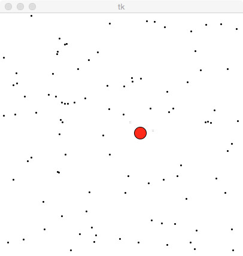

ISHINOMAKI HACKATHON 2017

# Artificial Life
http://alife.org/

# System
- Artificial Neural Network using TensorFlow
- Genetic Algorithm for reinforcing NN using Numpy

# Task
時間内により多くの黒い玉を取得する  

# エージェント
## 環境とのインタラクション
- [入力] 前面(視野角180度)にセンサーを持っており、目標物(黒い玉）と壁を認識できるとする  
- [出力] 左右方向の出力

## コントローラ
- ニューラルネットワーク（入力層をセンサー入力、出力層を左右の推進力）

## GA
- NNの重みを1遺伝子として実装
- Population sizeは10〜50（計算時間が足りないので、小さめ。その代わり下記の工夫を加える）
- 交差は行わない (遺伝子長が短く、遺伝子の変化に弱いため)
- 突然変異（突然変異率: 1/遺伝子長） ←遺伝子長が短く、変化に弱いため
- トーナメント選択（サイズ: 2）
- エリート戦略←Population Sizeが小さく、計算時間も短かったため
- [独自施策] Selectionは1組みのみとし、他の個体は突然変異のみを行い、次の世代集団を構築する。これにより、集団の収束速度を極端に低くし多様性を高めた

## Technology
- TensorFlow v1.3: Neural Netowrk
- Numpy 1.13.1: GA & Environment
- tkinter: Graphical animation

## ref.
- [コーネル工科大学](https://www.youtube.com/watch?v=Ux_zoMqT5mc)
- [Genetic Algorithm Implementation in tensorflow](https://www.linkedin.com/pulse/genetic-algorithm-implementation-tensorflow-amit-k-jaiswal)
- [Evolutionary Neural Networks backed by TensorFlow and pure Python](https://github.com/thepropterhoc/TF-Genetic)
- [Let’s evolve a neural network with a genetic algorithm$(Q!=code included](https://blog.coast.ai/lets-evolve-a-neural-network-with-a-genetic-algorithm-code-included-8809bece164)
- [Genetic Algorithms with Deep Learning for Robot Navigation](http://www.doc.ic.ac.uk/~ejohns/Documents/christophe_steininger_thesis.pdf)
- [スーパーマリオをTensorflowで学習＆プレイしよう!!](http://qiita.com/tsunaki/items/ec2556dc147c6d263b9d)
- [TensorFlow API r1.3](https://www.tensorflow.org/versions/r1.3/api_guides/python/)
